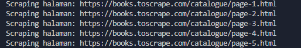
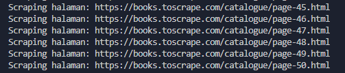
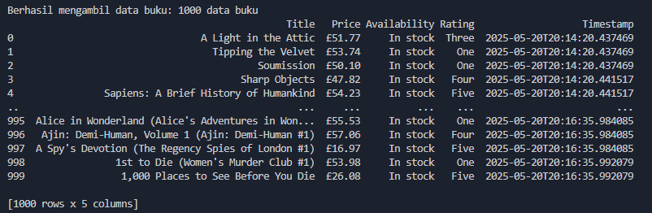
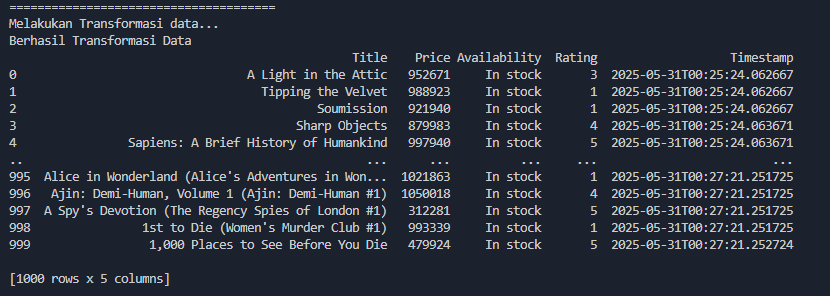
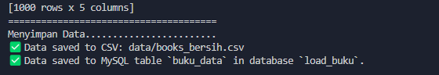
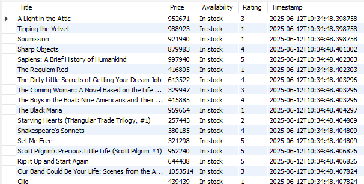

# 📚 BooksToScrape ETL Project

Proyek ini adalah bagian dari latihan ETL (Extract, Transform, Load) sederhana berbasis web scraping dari situs [Books to Scrape](https://books.toscrape.com). Proyek ini ditulis menggunakan Python, dan menggunakan struktur modular untuk proses scraping, serta akan dikembangkan lebih lanjut untuk transformasi dan load data.

---

## 🚀 Tujuan

- Melatih kemampuan scraping data dari HTML menggunakan `requests` dan `BeautifulSoup`
- Transformasi pada data mentah hasil scrapping
- Menyimpan data hasil scraping ke dalam file `.csv`
- Membangun pipeline ETL sederhana

---

## 🧪 Cara Menjalankan Proyek (Extract Phase)

### 1. Clone repositori
```bash
git clone https://github.com/wildanmujjahid29/Python-ETL-Project-BooksToScrape
```
```bash
cd BooksToScrape
```
### 2. Aktifkan virtual environment
Jika menggunakan CMD (Windows):
```bash
.env\Scripts\activate.bat
```

### 3. Instal dependensi
```bash
pip install -r requirements.txt
```
### 4. Menjalankan Proses ETL
```bash
python main.py
```

## ✅ Output

### 1. Ekstract




### 2. Transform


### 3. Load

